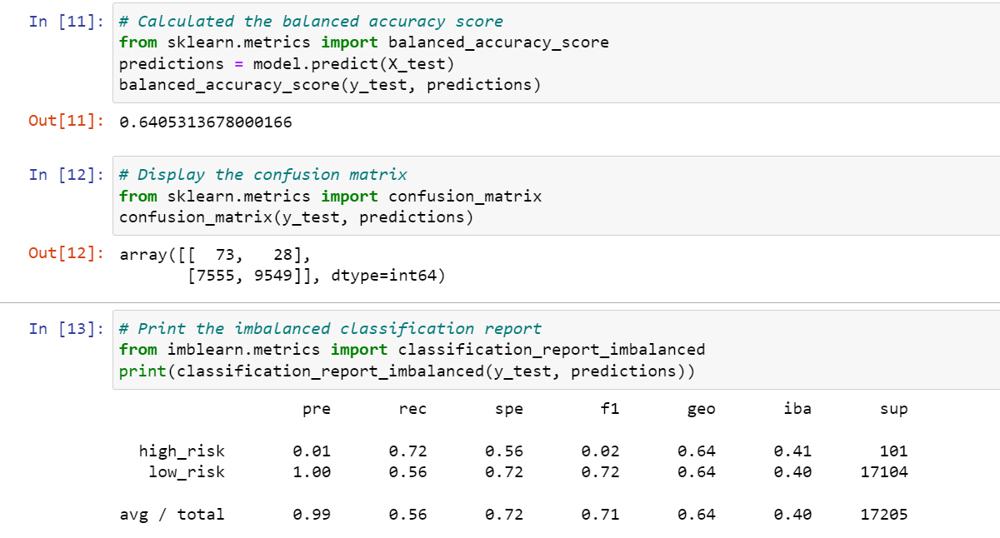
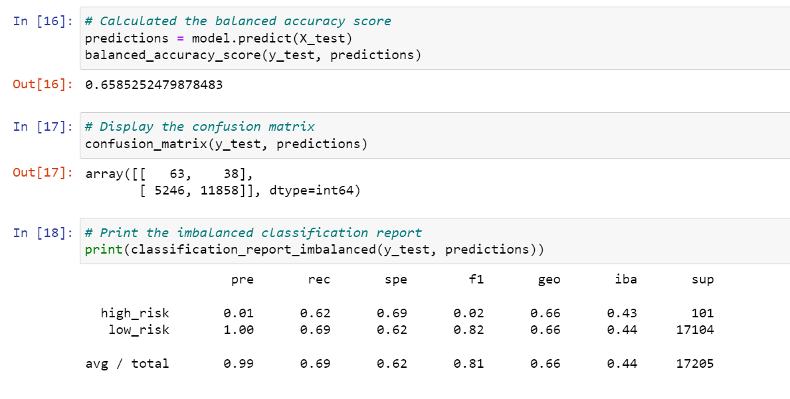
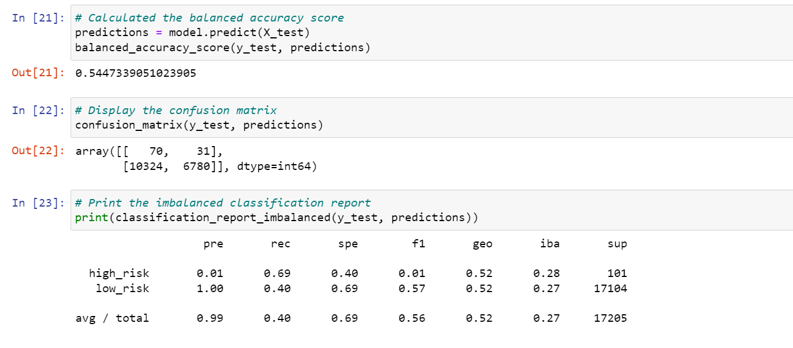
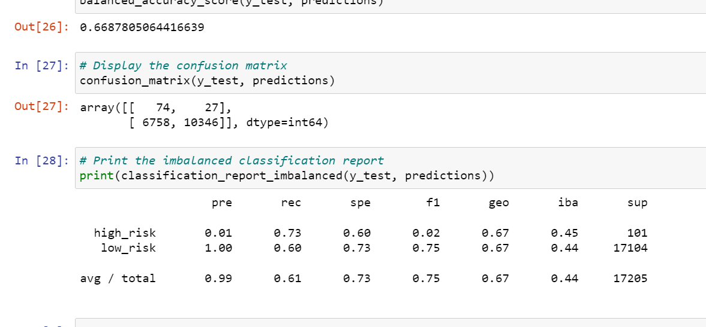
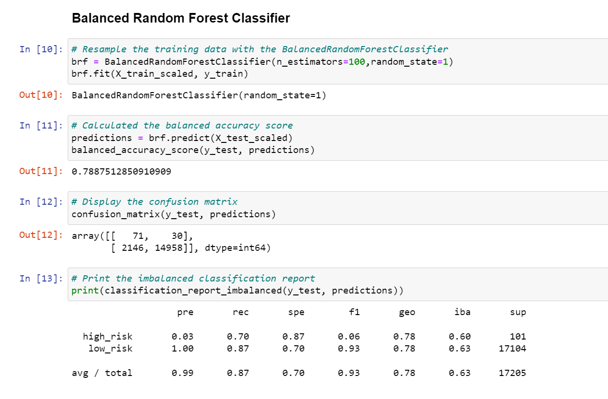
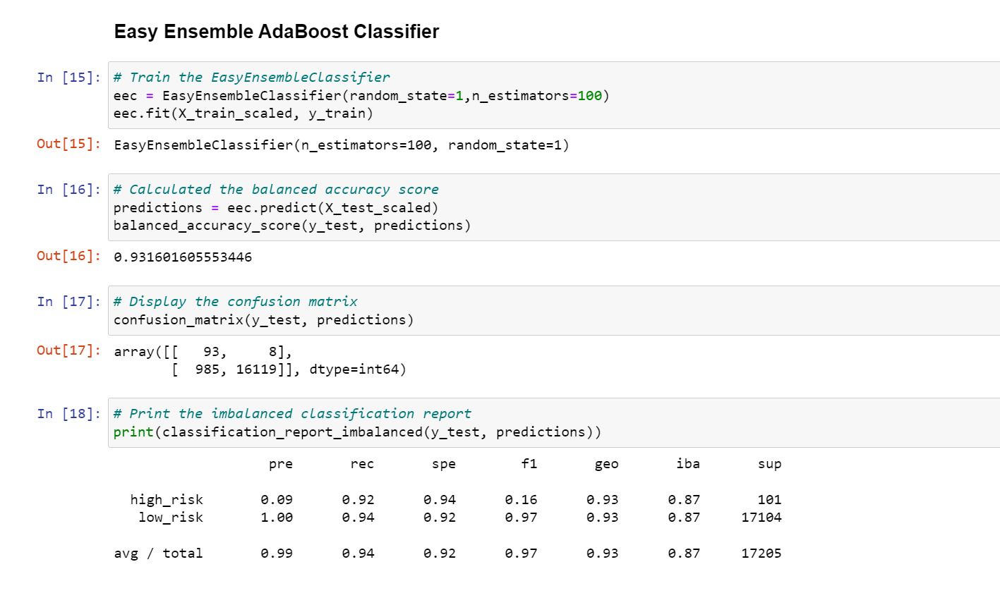

# Credit Risk Analysis

## Overview

The purpose of this analysis is to compare the performance of different models of supervised machine learning to sample and predict credit risk in an imbalanced dataset. Analyses were created in Jupyter Notebooks, using Python libraries imbalanced-learn, and scikit-learn. The machine learning models used in this project were naive random oversampling, SMOTE, cluster centroids, SMOTEEN, Balanced Random Forest, and Easy Ensemble.

## Results

This project assumes that a credit risk assessment aims to identify those people at high risk of debt. Thus, precision and recall metrics highlighted below are related to high risk on loan_status, that was considered as the positive result. Also, in this report, percentages were rounded to the nearest integer.

- **RandomOverSampler:** This model successfully predicted 73 cases of high risk as well 9549 low risk. On the other hand, 28 were false negatives, and 7555 false positives. Resulting in an accuracy score of 64%, precision of 1%, and recall of 72%.

     

- **SMOTE:** This model successfully predicted 63 cases of high risk as well 11858 low risk. While, 38 were false negatives, and 5246 false positives. Resulting in a balanced accuracy score of 66%, precision of 1%, and recall of 62%

     

- **ClusterCentroids:** This model successfully predicted 70 cases of high risk as well 6780 low risk. While, 31 were false negatives, and 10324 false positives. Resulting in a balanced accuracy score of 54%, precision of 1%, and recall of 69%.

     

- **SMOTEENN:** This model successfully predicted 74 cases of high risk as well 10346 low risk. While, 27 were false negatives, and 6758 false positives. Resulting in a balanced accuracy score of 66%, precision of 1%, and recall of 73%.

     

- **BalancedRandomForestClassifier:** This model successfully predicted 71 cases of high risk as well 14958 low risk. While, 30 were false negatives, and 2146 false positives. Resulting in a balanced accuracy score of 79%, precision of 3%, and recall of 70%.

     

- **EasyEnsembleClassifier:** This model successfully predicted 93 cases of high risk as well 16119 low risk. While, 8 were false negatives, and 985 false positives. Resulting in a balanced accuracy score of 93%, precision of 9%, and recall of 92%.

     

## Summary

Taking only accuracy into consideration, ensemble models - Balanced Random Forest (79%) and Easy Ensemble (93%) - presented significantly better results than sampling models, which range between 54% and 66%.

Regarding recall, while the easy ensemble model presented a result of 92%, all other modules have their values between 62% and 73%.

Lastly, precision presents a small variation, with slightly better performance for ensemble models. 

To sum up, Easy Ensemble is the model that presents an overall better performance. Although its precision is higher among all models, the value (0.09) is still low. As a result, a high number of low-risk customers were wrongly classified as high-risk. Thus, none of the models are recommended for this particular task.